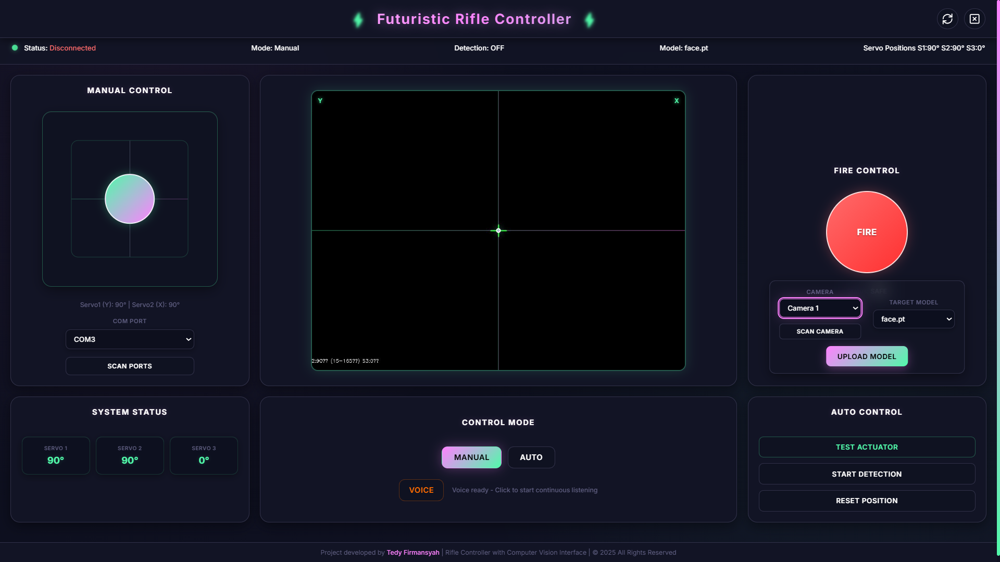
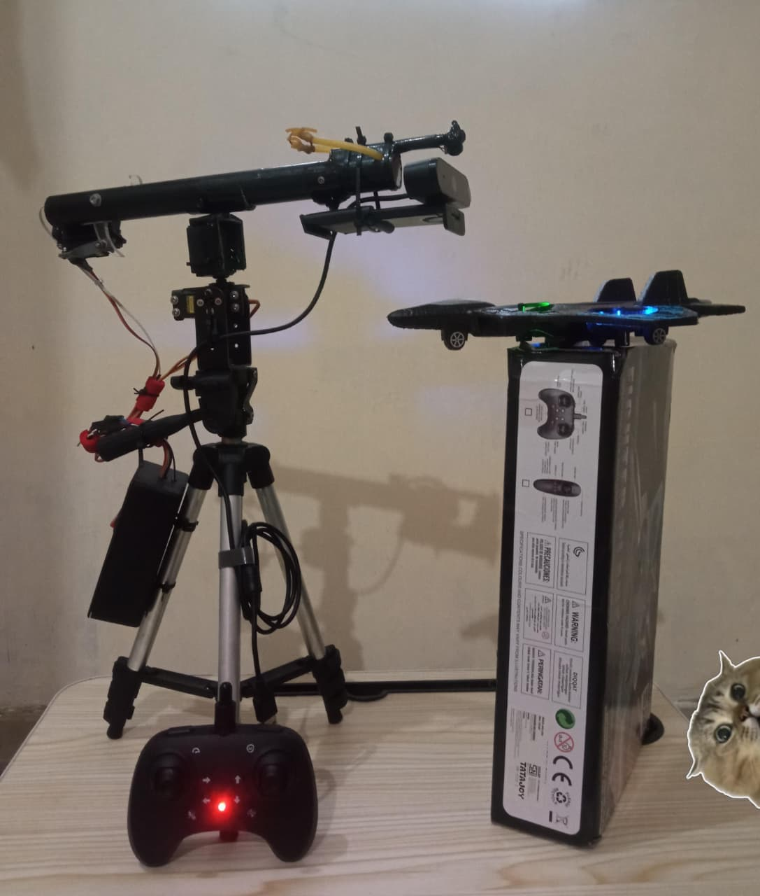

# 🎯 AI Shooter Robot

**AI Computer Vision Based Automatic Targeting System**


## 🖼️ Deployment Preview

<p align="center">
  
  
</p>

## 📋 Project Description

SHOT-AUTOMATION is an automatic targeting system that uses AI Computer Vision technology for object detection and precision targeting. The system is equipped with manual mode and voice control for maximum usage flexibility.

### ✨ Key Features

- 🤖 **Automatic Targeting** - AI detection using computer vision models
- 🎮 **Manual Mode** - Manual control for maximum precision  
- 🎙️ **Voice Control** - Voice command control via API
- 🎯 **Multi-Target Detection** - Multiple object detection (face, hand, red_ball)
- 📊 **Real-time Processing** - Real-time video processing
- 🌐 **Web Interface** - User-friendly web interface

## 🏗️ Project Structure

```
SHOT-AUTOMATION/
├── model/                 # AI models for object detection
│   ├── face.pt           # Face detection model
│   ├── hand.pt           # Hand detection model
│   └── red_ball.pt       # Red ball detection model
├── shot-automation/       # Core application
│   └── shot-automation.ino # Arduino firmware
├── static/               # Web static files
│   ├── css/             # Stylesheets
│   ├── js/              # JavaScript files
│   └── sound/           # Audio files
├── templates/            # HTML templates
│   └── index.html       # Main interface
├── app.py               # Main Flask application
├── port_scan.py         # Port scanning utility
├── requirements.txt     # Python dependencies
└── README.md           # Project documentation
```

## 🛠️ Technologies Used

### Development Tools
- **Google Colab** - AI model training
- **Arduino IDE** - Microcontroller programming
- **VS Code** - Development environment

### Tech Stack
- **Backend**: Python, Flask
- **Frontend**: HTML, CSS, JavaScript
- **AI/ML**: OpenCV, PyTorch/TensorFlow
- **Hardware**: Arduino, Servo Motors
- **Audio**: Web Speech API

## 🚀 Installation and Setup

### Prerequisites
```bash
# Ensure Python 3.8+ is installed
python --version

# Install Arduino IDE
# Download from: https://www.arduino.cc/en/software
```

### 1. Clone Repository
```bash
git clone https://github.com/username/shot-automation.git
cd shot-automation
```

### 2. Setup Python Environment
```bash
# Create virtual environment
python -m venv venv

# Activate virtual environment
# Windows:
venv\Scripts\activate
# Linux/Mac:
source venv/bin/activate

# Install dependencies
pip install -r requirements.txt
```

### 3. Setup Arduino
1. Open Arduino IDE
2. Load file `shot-automation/shot-automation.ino`
3. Select appropriate board and port
4. Upload to Arduino

### 4. Run Application
```bash
python app.py
```

Access application at: `http://localhost:5000`

## 🎮 Usage Guide

### Automatic Mode
1. Select target detection (face/hand/red_ball)
2. Click "Start Auto Mode"
3. System will automatically detect and aim

### Manual Mode
1. Use directional controls on web interface
2. Control servos manually with high precision

### Voice Control
1. Click microphone button
2. Give voice commands:
   - "Start auto mode"
   - "Switch to manual"
   - "Move left/right/up/down"
   - "Fire"
   - "Stop"

## 🔧 Configuration

### Model Configuration
Edit model configuration in `app.py`:
```python
MODELS = {
    'face': 'model/face.pt',
    'hand': 'model/hand.pt', 
    'red_ball': 'model/red_ball.pt'
}
```

### Arduino Configuration
Adjust pin configuration in `shot-automation.ino`:
```cpp
#define SERVO_X_PIN 9
#define SERVO_Y_PIN 10
#define TRIGGER_PIN 11
```

## 📡 API Endpoints

| Method | Endpoint | Description |
|--------|----------|-------------|
| GET | `/` | Main interface |
| POST | `/start_auto` | Start automatic mode |
| POST | `/manual_control` | Manual control |
| POST | `/voice_command` | Process voice commands |
| GET | `/video_feed` | Real-time video stream |

## 🎯 Model Training

To train new models using Google Colab:

1. Upload dataset to Google Drive
2. Open Colab notebook for training
3. Run training script
4. Download trained `.pt` model
5. Move to `model/` folder

## ⚙️ Hardware Requirements

### Minimum Requirements
- Arduino Uno/Nano
- 2x Servo Motors (SG90 or equivalent)
- USB Camera/Webcam
- Breadboard and jumper wires

### Recommended Setup
- Arduino Mega (for better performance)
- High-torque servo motors
- HD Camera with auto-focus
- External power supply for servos

## 🔍 Troubleshooting

### Common Issues

**Camera not detected:**
```bash
# Check available cameras
python -c "import cv2; print(cv2.VideoCapture(0).isOpened())"
```

**Arduino port not found:**
```bash
# Run port scanner
python port_scan.py
```

**Model loading error:**
- Ensure model `.pt` files exist in `model/` folder
- Check PyTorch version compatibility

## 🤝 Contributing

1. Fork the repository
2. Create feature branch (`git checkout -b feature/AmazingFeature`)
3. Commit changes (`git commit -m 'Add some AmazingFeature'`)
4. Push to branch (`git push origin feature/AmazingFeature`)
5. Open Pull Request

## 📄 License

Distributed under the MIT License. See `LICENSE` for more information.

## 📞 Contact

**Developer**: Tedy Firmansyah
- Email: tedysyhh07@gmail.com
- LinkedIn: [Tedy Firmansyah](https://www.linkedin.com/in/tedy-firmansyah-305ab5340)
- GitHub: [@Tedshub](https://github.com/Tedshub)

## 🙏 Acknowledgments

- [OpenCV](https://opencv.org/) for computer vision library
- [Flask](https://flask.palletsprojects.com/) for web framework
- [ESP32](https://www.espressif.com/) for microcontroller platform
- [Google Colab](https://colab.research.google.com/) for training environment

---

⭐ **Don't forget to give this project a star if it helped you!** ⭐
