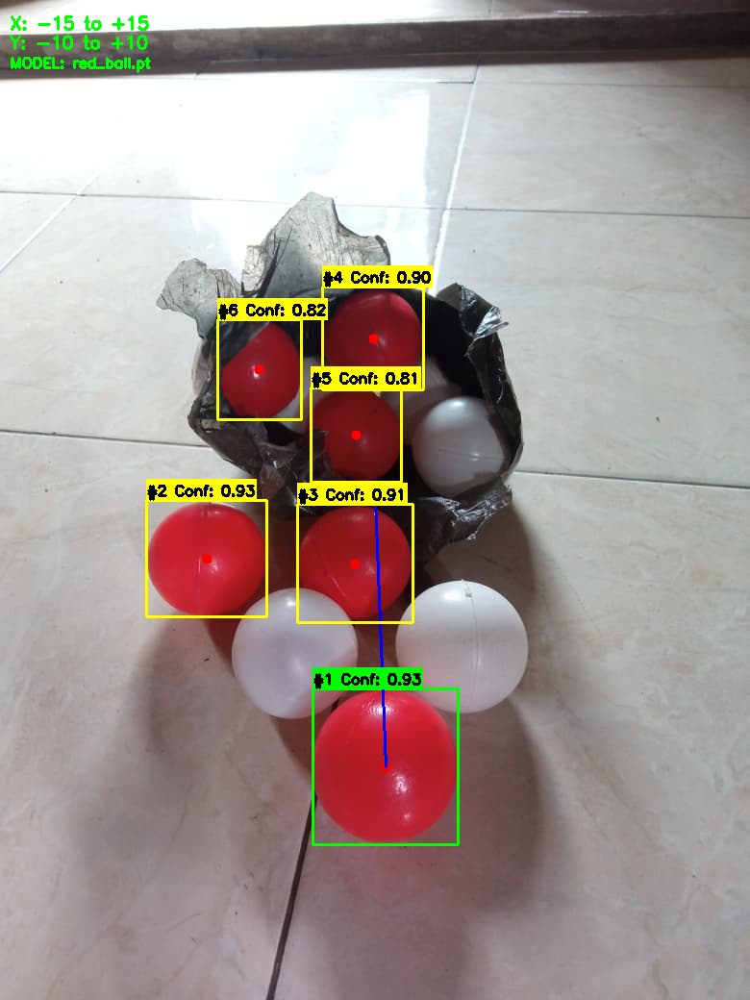

# AI Shooter Robot

**AI Computer Vision-Based Automatic Targeting System**


## Deployment Preview

<p align="center">
  
  
</p>

## Project Description

SHOT-AUTOMATION is a prototype automated targeting system (pan-tilt turret shooter) powered by Computer Vision and an ESP32 microcontroller. The system uses YOLO (You Only Look Once) deep learning models to detect target objects in real-time, calculates spatial displacement errors relative to the camera frame center, and drives pan and tilt servos with closed-loop proportional control for target tracking.

The application features a modern dark-themed web interface offering manual control via a virtual joystick, trigger firing action, automated target tracking, voice command control, and dynamic switching of input cameras and detection models.

### Key Features

- **Automatic Targeting**: Autonomous target tracking using proportional control loops on pan and tilt servo axes.
- **Manual Mode**: High-precision manual positioning using a touchscreen/mouse virtual joystick on the web interface.
- **Trigger Control**: Actuation of the firing trigger servo (Servo 3) in both manual and automatic modes.
- **Voice Control**: Voice command processing using the Web Speech API for mode transitions, directional nudges, and firing.
- **Multi-Target Detection**: Dynamic selection of YOLO models (`face.pt`, `hand.pt`, `red_ball.pt`).
- **Offline Simulation & Benchmarking**: Standalone simulation scripts for image/video evaluation, alongside analytical scripts for servo settling times and step response curves.
- **Web Interface**: Responsive, zero-latency dark-mode interface featuring real-time video streaming, telemetry readouts, and integrated synthesizer audio cues.

## Project Structure

```
SHOT-AUTOMATION/
├── c++_code/              # Microcontroller firmware
│   └── shot-automation.ino # ESP32 Arduino sketch for 3-axis servo actuation
├── img/                   # Documentation and input sample assets
│   ├── doc1.png           # Web interface screenshot
│   ├── doc2.jpeg          # Physical hardware setup
│   └── tes.png            # Input test image for offline simulation
├── model/                 # YOLO model weights (.pt)
│   ├── face.pt            # Face detection model
│   ├── hand.pt            # Hand detection model
│   └── red_ball.pt        # Red ball detection model
├── result/                # Simulation output artifacts
│   └── tes_result.png     # Rendered multi-object detection visualization
├── static/                # Web frontend static assets
│   ├── css/               # Modern dark styling (styles.css)
│   ├── js/                # Client logic and visualizers (script.js, visualizer.js)
│   └── sound/             # UI feedback audio files
├── templates/             # Server templates
│   └── index.html         # Main dashboard layout
├── app.py                 # Core Flask backend, video stream pipeline, and serial driver
├── simulation.py          # Standalone simulation script for image and video inference
├── plot_accuracy.py       # Data analysis script: Settling time vs. pixel distance
├── step_response_test.py  # Control loop evaluation: P-Control vs. PID response
├── manual_book.md         # Comprehensive hardware and operation manual (Indonesian)
├── requirements.txt      # Python package dependencies
└── README.md              # Project documentation
```

## Detection Simulation & Analysis

The repository includes a dedicated simulation script, `simulation.py`, which allows testing of YOLO detection logic and coordinate calculations without connecting physical microcontroller hardware.

### Multi-Object Detection Simulation

When running `simulation.py`, the system processes the test image `img/tes.png` using `model/red_ball.pt`. Every detected object exceeding the confidence threshold is annotated with bounding boxes, center coordinates, numbered sequence tags, confidence scores, and relative distance vectors toward the primary target.

<p align="center">
  
</p>

*Visualization of `result/tes_result.png` generated by `simulation.py`, showcasing multi-object red ball identification and offset tracking vectors.*

### Performance Evaluation Scripts

1. **`plot_accuracy.py`**: Generates a scatter plot with regression analysis comparing target distance from the frame center (in pixels) against the servo stabilization duration (*settling time*).
2. **`step_response_test.py`**: Simulates and plots servo tracking step responses, highlighting the trade-offs between *P-Control* and *PID Control*.

Run the simulation and analysis scripts:
```bash
python simulation.py
python plot_accuracy.py
python step_response_test.py
```

## Technologies Used

### Development Tools
- **Google Colab**: Model training, dataset labeling pipelines, and PyTorch export
- **Arduino IDE**: Firmware compilation and ESP32 flashing
- **VS Code**: Core application development environment

### Tech Stack
- **Backend**: Python 3.8+, Flask, PySerial
- **Computer Vision & ML**: OpenCV, Ultralytics YOLO, PyTorch
- **Frontend**: HTML5, Vanilla CSS (Dark Theme Architecture), JavaScript (ES6+), Web Audio API
- **Hardware Platform**: ESP32 Dev Module, 3x Micro Servos (MG90S / SG90), USB Webcam

## Installation and Setup

### Prerequisites
- Python 3.8 or higher
- Arduino IDE with ESP32 board support and `ESP32Servo` library installed
- USB ports connected to both the ESP32 module and a webcam

### 1. Clone Repository
```bash
git clone https://github.com/Tedshub/shooter-ai.git
cd shooter-ai
```

### 2. Setup Python Virtual Environment
```bash
# Create virtual environment
python -m venv venv

# Activate virtual environment
# Windows:
.\venv\Scripts\activate
# Linux/Mac:
source venv/bin/activate

# Install required dependencies
pip install -r requirements.txt
```

### 3. Flash ESP32 Firmware
1. Connect the ESP32 board to your computer via USB.
2. Open `c++_code/shot-automation.ino` in the Arduino IDE.
3. Verify the GPIO servo pin mappings:
   - Y-Axis Servo (Tilt): GPIO 18
   - X-Axis Servo (Pan): GPIO 19
   - Trigger Servo: GPIO 23
4. Select **DOIT ESP32 DEVKIT V1** (or matching board type) and the appropriate COM Port.
5. Click **Upload** to compile and flash the firmware.

### 4. Run the Application
```bash
python app.py
```
Open your web browser and navigate to: `http://127.0.0.1:5000`

## Operating Modes

### Automatic Mode
1. Choose an active detection model from the navigation bar (`face.pt`, `hand.pt`, or `red_ball.pt`).
2. Toggle the **AUTO TRACKING** switch on.
3. The system tracks the detected object, computes the deviation from center coordinates (deadzone: 1.0 px), and dynamically commands the pan and tilt servos to keep the target centered.

### Manual Mode
1. Use the on-screen **Virtual Joystick** or slider controls to manually adjust the pan (0–180 degrees) and tilt (0–180 degrees) angles.
2. Click the **FIRE** button to actuate the trigger servo for a 300 ms pulse before returning to standby.

### Voice Control
1. Click the microphone icon to initialize browser voice recognition.
2. Supported voice commands:
   - `"Start auto mode"` / `"Mode otomatis"`
   - `"Switch to manual"` / `"Mode manual"`
   - `"Move left"`, `"Move right"`, `"Move up"`, `"Move down"`
   - `"Fire"` / `"Tembak"`
   - `"Stop"` / `"Reset"`

## Communication Protocol

Communication between the Flask backend (`app.py`) and the ESP32 occurs over a serial link operating at 115200 baud using formatted strings:

```text
S1,<tilt_angle>,S2,<pan_angle>\n   # Pan/Tilt positioning command
FIRE\n                              # Trigger actuation command
```

## API Endpoints

| Method | Endpoint | Description |
|---|---|---|
| GET | `/` | Serves main web application dashboard |
| GET | `/video_feed` | MJPEG video stream with real-time detection bounding boxes |
| POST | `/api/servo` | Updates target servo pan and tilt angles |
| POST | `/api/fire` | Triggers the firing servo mechanism |
| POST | `/api/mode` | Toggles between Manual and Auto Tracking modes |
| POST | `/api/model` | Hot-swaps the loaded YOLO model file |
| POST | `/api/scan_ports` | Scans for available serial COM ports |
| POST | `/api/voice_command` | Processes speech-to-text voice command strings |

## Hardware Wiring Reference

| Component | ESP32 Pin | Function |
|---|---|---|
| Servo 1 (Y-Axis / Tilt) | GPIO 18 | PWM control signal for elevation |
| Servo 2 (X-Axis / Pan) | GPIO 19 | PWM control signal for azimuth |
| Servo 3 (Trigger) | GPIO 23 | PWM control signal for firing trigger |
| Servo Power Supply | External 5V 2A | Power rail for servos (share common GND with ESP32) |
| Webcam | USB Host | Video capture feed for computer vision pipeline |

## Troubleshooting

- **Serial Port In Use / Error**: Ensure that the Arduino IDE Serial Monitor or any other terminal software is closed before running `app.py`. Use the **Scan Ports** button in the web dashboard to re-bind the active port.
- **Camera Stream Failed**: Confirm your camera device index in `app.py` (default: `0`). You can also switch camera devices directly using the dropdown menu in the web UI.
- **Model Loading Issue**: Ensure all required `.pt` files reside inside the `model/` folder and that the `ultralytics` package is properly installed in your active virtual environment.

## Contact

**Developer**: Tedy Firmansyah
- Email: tedysyhh07@gmail.com
- LinkedIn: [Tedy Firmansyah](https://www.linkedin.com/in/tedy-firmansyah-305ab5340)
- GitHub: [@Tedshub](https://github.com/Tedshub)

## License

Distributed under the MIT License. See `LICENSE` for more information.
